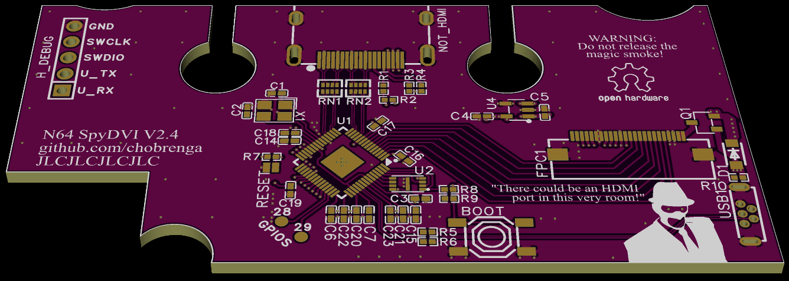
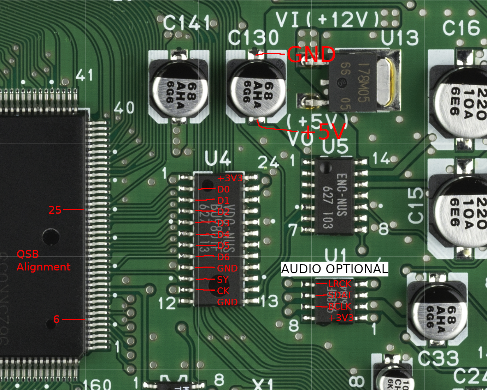
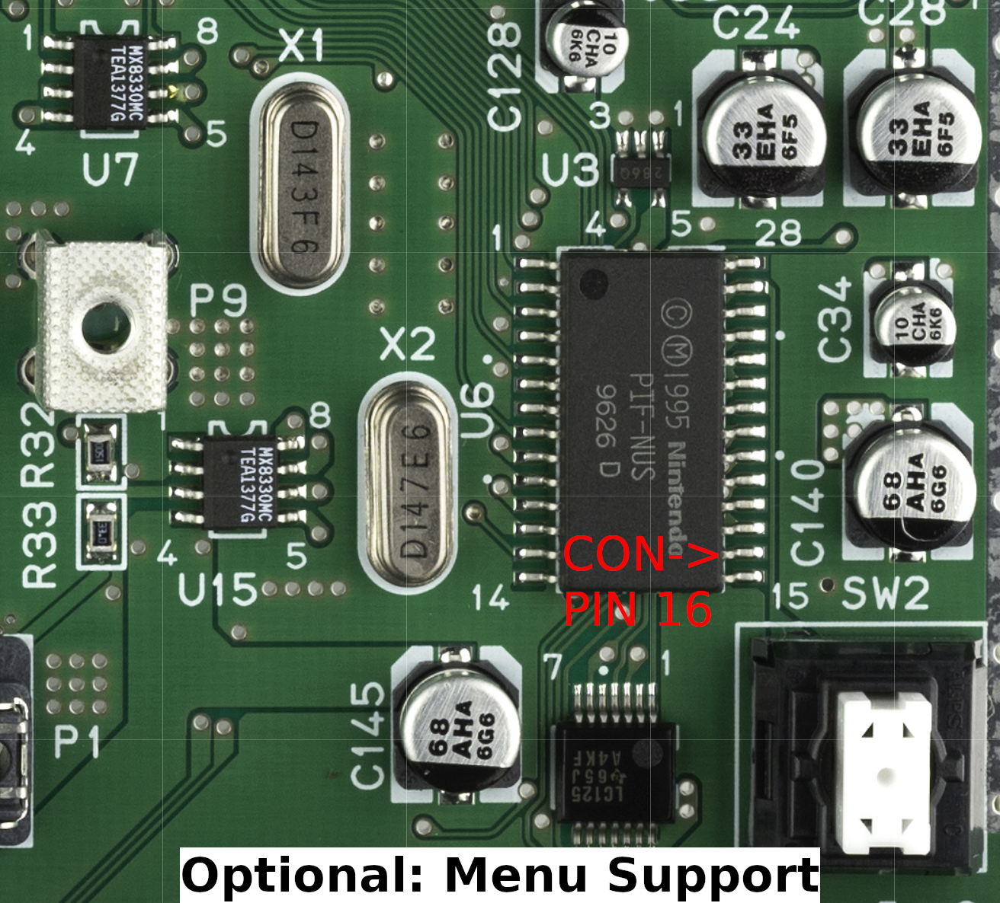

# Meet the N64 SpyDVI

N64 DVI mod board using RP2040 and some DVI bit banging firmware from the [PicoDVI-N64](https://github.com/kbeckmann/PicoDVI-N64) project. Should be able to be installed as cut or no cut.

Currently no QSB, use N64 Header. N64 Header is a 20 pin 1.27mm pitch connection, of which can be bought on Amazon.

The board only needs a 5V supply, there is a 3.3V regulator onboard to generate logic level. The RP2040 itself generates the 1.1V it needs for operaton. The MOSFET Q1 cuts off the 5V from the console when the usb is inserted, so it should be able to be programmed while installed.

Custom 3D printed bracket, braces, and facia are planned, but not yet available. The ones from Peter Bartmann's [n64adv2_pcb](https://github.com/borti4938/n64adv2_pcb) should work just fine.

# Fabrication Notes

This board has not been fabricated and tested as of yet. If you do order, I always recommended the latest revision.

R8 is intentionally missing on the BOM. It is not required.
RESET is missing in the BOM, this is because it's only a pair of pads. This is not an issue.

This is intended for fabrication with JLC04161H-7628(Standard). Enable impedance control.

*For V2.0 Select 0.15mm via option, 4-Wire Kelvin Test is mandatory. (Not recommended, use newer revision)

*For V2.1 Select 0.25mm via option, 4-Wire Kelvin Test is still mandatory.

*For V2.2 and beyond vias are 0.3mm minimum, so no special requirements regarding testing. This was done to reduce manufacturing costs.

This is not and will not be compatible with the Hispeedido flex cable, even though they have the same number of pins.

# Credit Given

Konrad Beckmann for initial inspiration and some initial firmware. Repo: [PicoDVI-N64](https://github.com/kbeckmann/PicoDVI-N64)

Wren6991 for sparking Konrad's project, and providing a functional DVI board schematic which my design is based on. [PicoDVI](https://github.com/Wren6991/PicoDVI)

# Schematics

# Wiring

Note: Controller support currently not implemented.

# Board Layout

# Fitment

#TODO
- Add QSB Ribbon (In Progress)
- Supply modified firmware (Untested)
- Design 3D Printed No-Cut Kit (Not Started)
- Design 3D Printed Cut Kit (Not Started)
- Add settings menu to firmware (Not Started)
