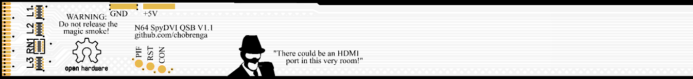
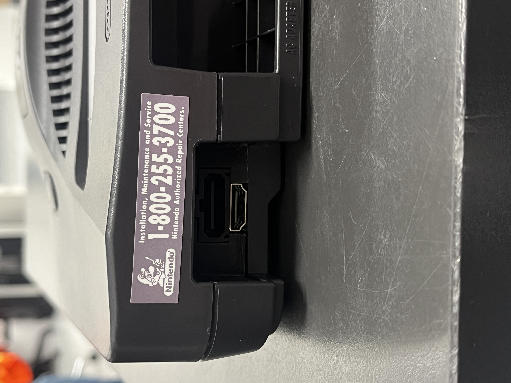

# Meet the N64 SpyDVI

N64 DVI mod board using RP2040 and some DVI bit banging firmware from the [PicoDVI-N64](https://github.com/kbeckmann/PicoDVI-N64) project. Should be able to be installed as cut or no cut.

~~Currently no QSB, use N64 Header. N64 Header is a 20 pin 1.27mm pitch connection, of which can be bought on Amazon.~~

Please use the QSB moving forward. The header had too many signaling issues. My first batch of the QSB is being ordered soon for testing. :)

The board only needs a 5V supply, there is a 3.3V regulator onboard to generate logic level. The RP2040 itself generates the 1.1V it needs for operaton. The MOSFET Q1 cuts off the 5V from the console when the usb is inserted, so it should be able to be programmed while installed.

Custom 3D printed bracket, braces, and facia are planned, but not yet available. The ones from Peter Bartmann's [n64adv2_pcb](https://github.com/borti4938/n64adv2_pcb) should work just fine.

# Fabrication Notes

~~This board has not been fabricated and tested as of yet. I have placed an order and will be testing very soon. If you do order, I always recommended the latest revision.~~

The board worked well enough that I will continue the project. With no audio lines connected, I got a clean video signal. Currently working on the QSB.

**R8** is intentionally missing on the BOM. It is not required. May be removed from schematic in final design.
**RESET** is missing in the BOM, this is because it's only a pair of pads. This is not an issue.

This is intended for fabrication with **JLC04161H-7628(Standard)**. Enable **impedance control**.

### Potential cost savings

Leaving the debug header unpopulated would save some cost for the final production run.

~~Removing the N64 pin header and stuffing resistors would reduce cost, once the QSB is available.~~

Potential to shrink the board layout and panelize the board, could significantly reduce manufacturing costs.

### Revision Notes

#### Main Board
* For V2.0 Select 0.15mm via option, 4-Wire Kelvin Test is mandatory. (Not recommended, use newer revision)
* For V2.1 Select 0.25mm via option, 4-Wire Kelvin Test is still mandatory.
* For V2.2 and beyond vias are 0.3mm minimum, so no special requirements regarding testing. This was done to reduce manufacturing costs.
* For V2.3 things were only slightly moved around. Was not worth going to the trouble to update the GitHub.
* For V2.4 the N64 Pin Header was removed along witht he stuffing resistors. Header was causing signal reflection issues.

#### Ribbon
* V1.0C is a compatibility version for main boards V2.0 and V2.1
* V1.0 is for V2.2 and newer. It has a few errors.
* V1.1 removes solder mask from the FPC connection area, along with fixing a few small issues.

This is not and will not be compatible with the Hispeedido flex cable, even though they have the same number of pins.

# Credit Given

Konrad Beckmann for initial inspiration and some initial firmware. Repo: [PicoDVI-N64](https://github.com/kbeckmann/PicoDVI-N64)

Wren6991 for sparking Konrad's project, and providing a functional DVI board schematic which my design is based on. [PicoDVI](https://github.com/Wren6991/PicoDVI)

The various and wonderful people in Konrad Beckmann's Discord server have also been a massive help! Thank you all!

# Schematics

## QSB Ribbon

# Wiring

Note: Controller support currently not implemented.
Note: The QSB handles all AV Signals. Power, GND, and CON still need wires.

Below is an example of an installed kit.

# Board Layout

## Ribbon layout

# Fitment

# Software Notes

The project started with EasyEDA Standard edition, but has migrated to EasyEDA Pro for the Flex Cable support.

# Development Tasks
- [X] Layout Board
- [X] Order first production run
- [X] Modify Konrad's Firmware for SpyDVI
- [X] Test first production run
- [X] Add control monitoring
- [X] Design QSB Ribbon V1
- [X] Order QSB Ribbon V1
- [ ] Test QSB with an without V2.2 stuffing resistors
- [X] Take pictures of QSB install for Readme
- [ ] Find appropriate scaling methods
- [ ] Side-By-Side Test VS Multi Out
- [ ] Add settings menu and Hotkeys
- [X] Design 3D Printed No-Cut Kit
- [ ] Design 3D Printed Cut Kit
