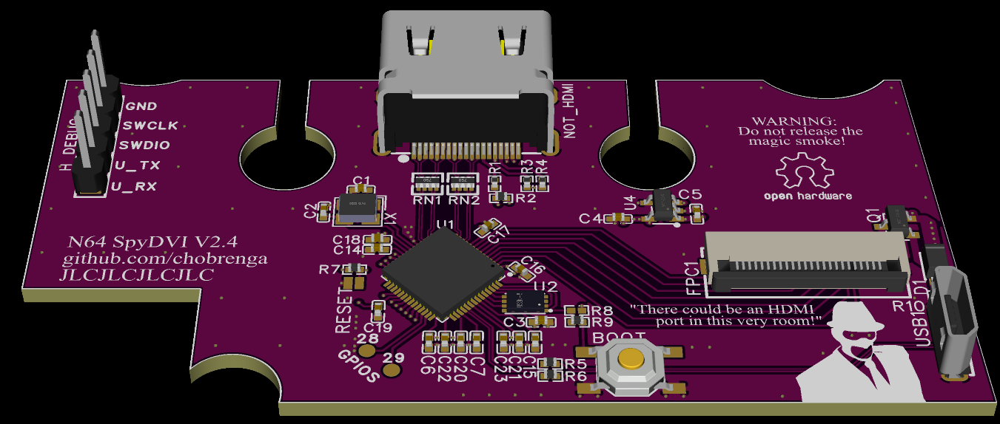

# N64-SpyDVI
N64 DVI mod board using RP2040 and some DVI bit banging firmware from the [PicoDVI-N64](https://github.com/kbeckmann/PicoDVI-N64) project. Should be able to be installed as cut or no cut.

A QSB ribbon is planned for this project, but you can totally just solder the wires in accordance with Beckmann's diagram. I even left headers available for such a job.

The audio circuit is optional. 

The board only needs a 5V supply, there is a 3.3V regulator onboard to generate logic level. The RP2040 itself generates the 1.1V it needs for operaton.

BEFORE YOU ORDER
This board has not been fabricated and tested as of yet.

# Credit Given
Konrad Beckmann for initial inspiration and some initial firmware. Repo: [PicoDVI-N64](https://github.com/kbeckmann/PicoDVI-N64)

Wren6991 for sparking Konrad's project, and providing a functional DVI board schematic which my design is based on. [PicoDVI](https://github.com/Wren6991/PicoDVI)
