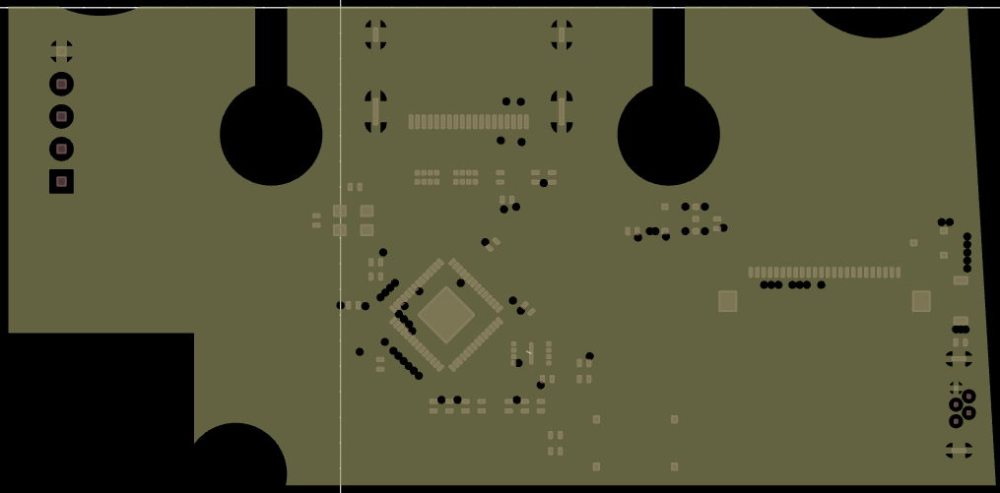

# Meet the N64 SpyDVI

N64 DVI mod board using RP2040 and some DVI bit banging firmware from the [PicoDVI-N64](https://github.com/kbeckmann/PicoDVI-N64) project. Should be able to be installed as cut or no cut.

A QSB ribbon is planned for this project, but you can totally just solder the wires in accordance with Beckmann's diagram. I even left headers available for such a job.

The audio circuit is optional. 

The board only needs a 5V supply, there is a 3.3V regulator onboard to generate logic level. The RP2040 itself generates the 1.1V it needs for operaton.

Custom 3D printed bracket, braces, and facia are planned, but not yet available. The ones from Peter Bartmann's [n64adv2_pcb](https://github.com/borti4938/n64adv2_pcb) should work just fine.

# Fabrication Notes

This board has not been fabricated and tested as of yet. If you do order, I always recommended the latest revision.

R8 is intentionally missing on the BOM. It is not required.
RESET is missing in the BOM, this is because it's only a pair of pads. This is not an issue.

This is intended for fabrication with JLC04161H-7628(Standard). Enable impedance control.

For V2.0 Select 0.15mm via option, 4-Wire Kelvin Test is mandatory. (Not recommended, use V2.1)
For V2.1 Select 0.25mm via option, 4-Wire Kelvin Test is still mandatory.
For V2.2 and beyond vias are 0.3mm minimum, so no special requirements regarding testing. This was done to reduce manufacturing costs.

Hookup schematic for headers can be found on Konrad's [PicoDVI-N64](https://github.com/kbeckmann/PicoDVI-N64). The headers are labeled.

This is not and will not be compatible with the Hispeedido flex cable, even though they have the same number of pins.

# Credit Given

Konrad Beckmann for initial inspiration and some initial firmware. Repo: [PicoDVI-N64](https://github.com/kbeckmann/PicoDVI-N64)

Wren6991 for sparking Konrad's project, and providing a functional DVI board schematic which my design is based on. [PicoDVI](https://github.com/Wren6991/PicoDVI)

# Schematic

# Board Layout

# Fitment

